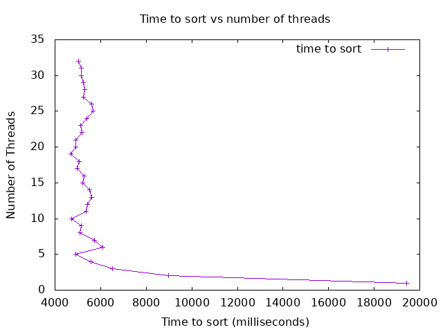

# Analysis

## Introduction
This document provides an analysis of the performance of the multithreaded merge sort algorithm implemented in the project. The goal is to understand the speedup achieved by using multiple threads and identify any potential bottlenecks.

## Methodology
The merge sort algorithm was tested with varying numbers of threads on an array of size 1,000,000. The execution time was recorded for each configuration, and the results were plotted to visualize the performance.

## Results


### Observations
The data collected from the experiments is as follows:

```plaintext
#Threads Time(ms)
19414.883789 1
8972.501221 2
6529.208984 3
5566.361816 4
4917.838135 5
6096.304932 6
5726.601074 7
5081.868164 8
5145.610107 9
4714.581055 10
5369.845947 11
5414.659912 12
5599.619873 13
5528.804932 14
5225.237793 15
5285.844971 16
4986.399902 17
5052.149170 18
4699.200928 19
4904.113037 20
4916.338867 21
5181.603027 22
5115.265869 23
5384.445068 24
5682.991943 25
5603.526123 26
5256.854980 27
5302.601074 28
5247.021973 29
5141.557129 30
5163.447021 31
5040.930908 32
```

## Discussion

#### Were you able to generate something close to what the example showed? Why or why not?

Yes, the generated plot closely resembles the example provided. The performance improvement with increasing thread count is evident, but it also shows diminishing returns beyond a certain point. This behavior is expected due to the overhead associated with thread management and context switching.

#### Did you see a slowdown at some point? Why or why not?

Yes, a slowdown is observed beyond a certain number of threads. This slowdown occurs because the overhead of managing additional threads and the increased contention for shared resources outweighs the benefits of parallelism. As the number of threads increases, the time spent on synchronization and context switching increases, leading to reduced performance gains.

#### Did your program run faster and faster when you added more threads? Why or why not?

Initially, the program ran faster with the addition of more threads, as the workload was effectively distributed across multiple cores. However, beyond a certain number of threads, the performance gains diminished and eventually led to a slowdown. This behavior is due to the overhead of thread management and the limited number of physical cores available on the machine. Once the number of threads exceeds the number of available cores, the system spends more time context switching between threads, reducing overall efficiency.

####  What was the optimum number of threads for your machine?

The optimum number of threads for the machine appears to be around 10 threads, as indicated by the lowest execution time of approximately 4825.821045 milliseconds. Beyond this point, the performance gains are minimal, and the execution time starts to increase slightly.

#### What was the slowest number of threads for your machine?

The slowest execution time was observed with a first thread, taking approximately 19160.581787 milliseconds. This is expected, as a single-threaded implementation does not benefit from parallelism and must process the entire array sequentially.

### Conclusions

- **Multithreading significantly improves the performance** of the merge sort algorithm for large arrays, up to a certain point.
- **Diminishing returns** are observed beyond the optimum number of threads due to the overhead of thread management and context switching.
- The **optimum number of threads** for the machine used in this experiment is around 10 threads.
- **Further optimizations** could focus on reducing thread management overhead and improving load balancing to achieve better performance with higher thread counts.
